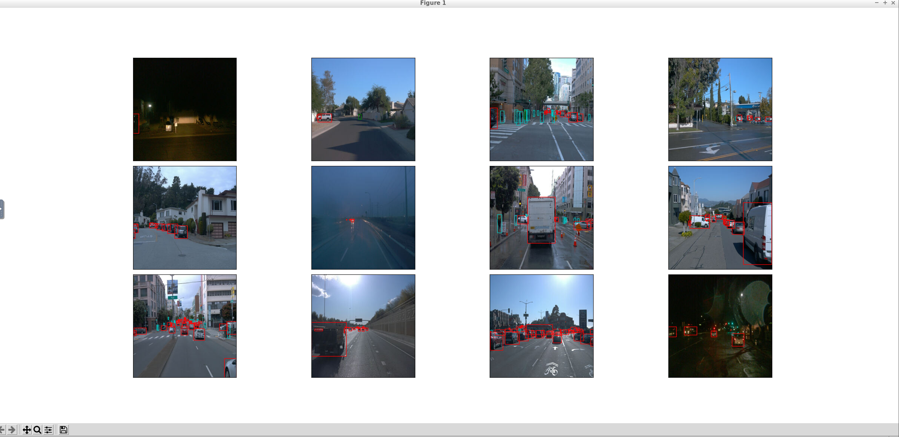
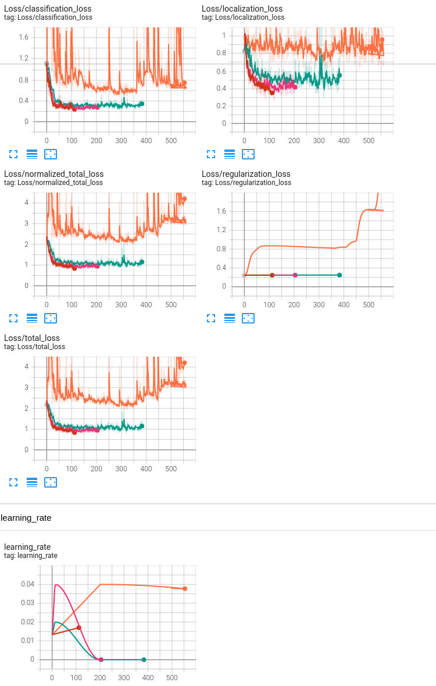
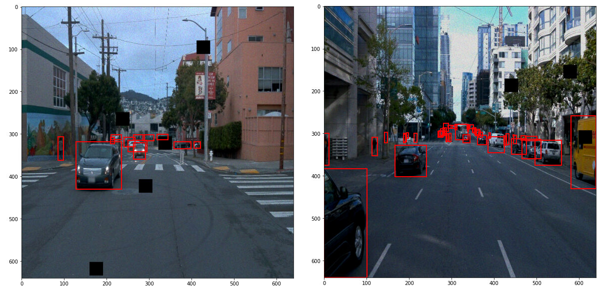
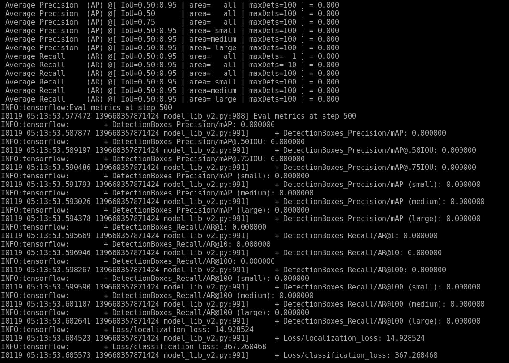
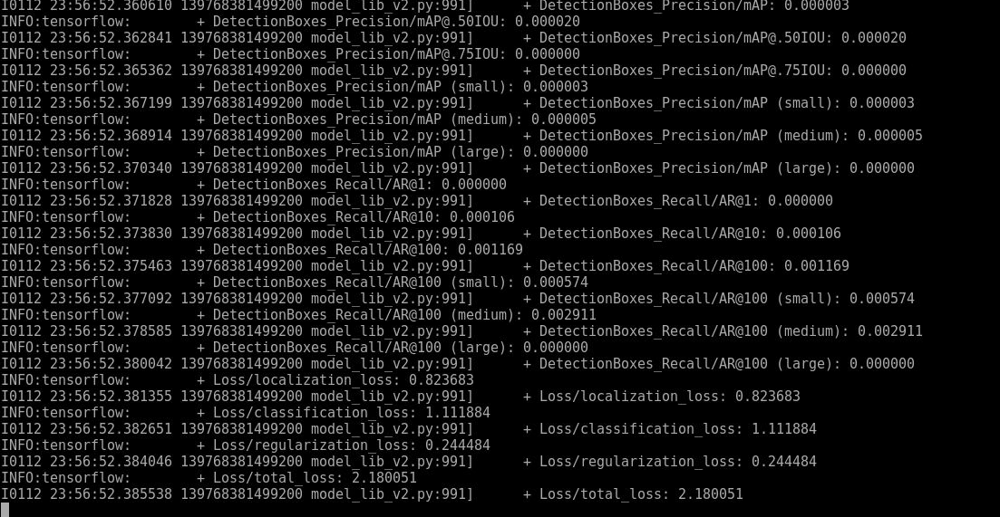

# Object Detection in an Urban Environment

# Project overview

The object detection project uses Waymo dataset images to train a network to find and classify any number of vehicles, pedestrians or cyclists in an image. It covers everything from the initial analysis and splitting of the data, to training and adjusting hyper parameters of a SSD Resnet 50 model, to evaluating results. Although SSD Resnet is not the gold standard, it provides a great baseline to start and work their way up to other models such as Yolo. Object detection is one of the most important components of self-driving cars because it provides the vehicle with context on objects that are constantly around it such as other cars to navigate around, pedestrians to avoid or signs to read.
 
# Setup

## Data collecting
The first step to any machine learning project is to gather data. The data is typically sourced from the Waymo Open dataset. However, because the project was conducted in the given environment, the data was already provided and the reduced 10 frame TFrecords were already generated. An attempt was made to download and generate the reduced Tfrecords locally, however Tensorflow and Cuda compatibility issues prohibited this. 

## Visualization
Next comes the most important step, visualizing the data. It is important to understand the data that is being passed through the model. Matplotlib was used in Jupyter Notebook to overlay the ground truth bounding boxes and classes over the training images, and a few images were displayed to the screen as seen in the following figure.

For some context, Jupyter Notebook is a server running on your computer that can be accessed from a web browser. To start the notebook, the project directory was navigated to, which in the case of the provided environment was /home/workspace, and the following command was entered:
````
jupyter notebook --port 3002 --ip=0.0.0.0 --allow-root
````

The environment by default comes with Firefox, however the version of Firefox in the environment is unstable with jupyter notebook so Chrome with no sandbox mode is needed. 
````
sudo apt-get update
sudo apt-get install chromium-browser
sudo chromium-browser --no-sandbox
````

## Data Split
The data then needs to be split into training and validation directories. Testing data is already split so it is not necessary to add. I decided on a 90/10 split and updated the create_splits.py script to do so. To run this script the following command is executed:
````
python create_splits.py --source /home/workspace/data/waymo/training_validation --destination /home/workspace/data/waymo
````

Model generation and training
To facilitate the training process, the Tensorflow Object Detection API, or a config file containing variables for all parts of the model building process, such as training, model hyperparameters and data augmentation, is used. The default file pipeline.config must be edited for each new model. To do so, the following command is entered:
````
python edit_config.py --train_dir /home/workspace/data/waymo/train/ --eval_dir /home/workspace/data/waymo/val/ --batch_size 4 --checkpoint ./training/pretrained-models/ssd_resnet50_v1_fpn_640x640_coco17_tpu-8/checkpoint/ckpt-0 --label_map label_map.pbtxt
````

This generates a new pipeline called pipeline_new.config which will be moved. 
````
mv pipeline_new.config /home/workspace/experiments/reference/
````

To train the model, the following code is executed:
````
python experiments/model_main_tf2.py --model_dir=experiments/reference/ --pipeline_config_path=experiments/reference/pipeline_new.config
````

To evaluate the results of the model, the following code is executed:
````
python experiments/model_main_tf2.py --model_dir=experiments/reference/ --pipeline_config_path=experiments/reference/pipeline_new.config --checkpoint_dir=experiments/reference/
````

While testing, it is advised to monitor progress with Tensorboard which is similar to running a Jupyter Notebook. To do so, the following command is executed and a link is generated to navigate to in chrome:
````
python -m tensorboard.main --logdir experiments/
````

# Dataset
## Dataset analysis                                       
Starting with a visualization of a few random images in the dataset, figure 1 shows a few random images from the dataset. It is important to note the variation of scenarios and driving conditions in the images from figure 1. The conditions range anywhere from a rainy foggy night, to clear skies in crowded urban environments to highways and everything in between. The more corner cases and different environments the dataset contains, the easier it will be for the model to generalize and not overfit the data.


Figure 1: a few random images from the dataset with color coated bounding boxes

The dataset contains 97 TFRecords, each with 10 images. I went back to analyze the images after I split them into training and validation, so I only analyzed the 87 training TFRecord images. Out of the 870 training images, there was a mean of 18.4 and a standard deviation of 12.3 vehicles, a mean of 5.7 and a standard deviation of 9.4 pedestrians, and a mean of 0.15 and a standard deviation of 0.5 cyclists per image. 

# Cross validation
Cross validation can be used to analyze how well the model is able to predict the dataset. K-fold validation is the most common, where the training data is split and the model is trained on a portion of the data then the model predicts the untrained data. I did not use cross validation, but if I were to, I would implement sklearn’s gridsearch cv and specify a few starting learning rates, and batch sizes of 4, 16 and 32 to tune the hyper parameters. 
 
# Reference experiment
It is important to start small and improve features by changing one thing at a time. In doing so, it is easier to analyze how impactful every improvement is. For example, compare results of a model without and with data augmentation to find its effectiveness. 
The reference experiment was conducted as a baseline and without alteration to any hyper parameters. The results of the reference experiment are orange lines in the graphs in figure 2. 
 
These results are less than ideal, and I can do better. A few changes that can be made to improve performance are as follows:
    - Tune learning rate annealing 
    - Add data augmentation

# Improvements
## Learning Rate
The first and most impactful hyper parameter to be changed is the learning rate. By default, a momentum based optimizer with cosine decay is used to gradually reduce the learning rate for each epoch. The cosine decay contains an initial steep increase in learning rate, which then slowly reduces to 0. The initial settings are set up such that the learning rate increases to 0.04 after 200 epochs, then reduces to zero after 2500 epochs. For a model as complex as a SSD Resnet 50 with over 25 million trainable parameters, too many epochs will overfit the network to the data. To improve performance, the cosine decay was changed such that the increase in learning rate only took 10 epochs resulting in a total of 200 epochs. More information about this can be acquired from the Tensorflow cosine decay documentation. The type of optimizer was also changed from a momentum optimizer to rms prop as per the the optimizer.proto file in the Tensorflow Object Detection API Github. The result of this change was a steep reduction in training loss. The result of this alteration appears as a pink line in the graphs shown in figure 2. Halving the cosine learning rate annealing graph resulted in the green line.


Figure 2: Loss and learning rate graphs

# Data Augmentation
The second change I made was to add data augmentation. I added methods from the preprocessor proto file such as scaling all pixels by a random value from 0.9-1.1, randomly adjusting brightness and hue by a delta of 0.2, randomly adjusting contrast and saturation by 0.8 to 1.25, and randomly adding black patches. These changes are a great representation of real life variations in camera settings, for example on a rainy day, the image the camera collects will have less brightness and contrast as everything will be darker and greyer. The black patches will achieve the same effect as dropout in aiding the network in its ability to generalize. A few examples are shown in figure 3.


Figure 3: data augmentation visualization images

Results
The results of the reference and altered cosine learning rate annealing and data augmentation models are displayed in figure 4. The first image is cut off, but shows that the classification loss of the reference for example is 367 and is reduced to 1.1 after the learning rate annealing is tuned and data augmentation is added. Unfortunately, I was unable to get the model to predict boxes and the precision and recall are almost 0 for every model I ran. I plan on replicating this experiment locally once I get tensorflow and cuda to play nice.



Figure 4: Results, (top) reference, (bottom) learning rate anealling tune and data augmentation